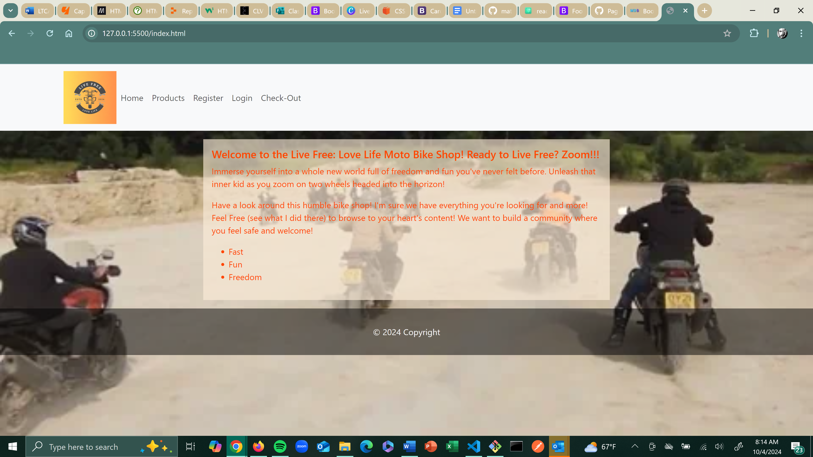
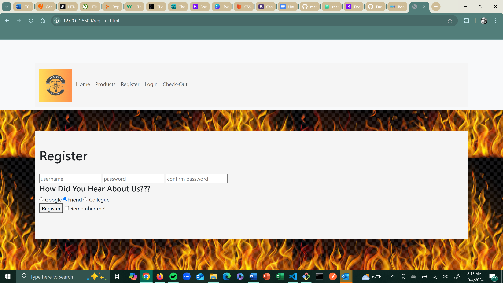

# Capstone
# Live Free Bike Shop

Welcome to my **Live Free: Love Life Bike Shop**! This capstone project was my first ever intro into coding and my first project for my Year Up program's Pluralsight Learn to Code Academy in Frontend Development. This project showcases a culmination of basic HTML, CSS, and Bootstrap skills learned through my instructor Kevin Long, collaboration with my cohort peers, and of course lots of Google to bring to life an example retail website that sells motorcycles and related gear. I have integrated everything to my disposal within my current knowledge of coding to bring this project to life!

## 🛠️ Tools & Technologies

- **HTML5**, **CSS3**: Used for the structure, styling, and functionality of the website.
- **Bootstrap**: Ensures a modern, responsive design across devices.


### Scripts & Libraries
- **Bootstrap**: [Bootstrap](https://stackpath.bootstrapcdn.com/bootstrap/4.5.2/css/bootstrap.min.css) for layout and components.
- **Stylesheets** [Stylesheet](https://cdnjs.cloudflare.com/ajax/libs/font-awesome/4.7.0/css/font-awesome.min.css)

## 💻 How to Run the Project

1. Clone the repository: `git clone https://junhokim7.github.io/Capstone/`
2. Open `index.html` in your browser to view the site.


## 🖼️ Product Designs

All products within the shop were images taken from Google and various existing retailers, formatted to fit and match my site. My logo was created through Canva and includes edits and original touches by me. The logo embodies the store and also is imbued with a "Stomp" animation. 

## 🌐 Website Previews

Here are some previews of the website pages:

### Homepage



### Products Page


### Checkout Page


### Register Page


### Login Page


## 🏗️ Project Structure

```bash
.
├── checkout.html         # Checkout page
├── index.html            # Homepage with product listings
├── login.html            # Login page
├── products.html         # Page displaying all posters
├── register.html         # Registration page
├── css/
│   └── styles.css        # Main stylesheet
├── images/
│   ├── giphy.webp          # Logo for the website
│   └── images/          # Folder containing all product and site images
│       ├── 1.png
│       ├── 2.png
│       ├── 3.png
│       ├── 4.png
│       ├── 5.png
│       └── 6.png


## 🏆 Credits
- ** Kevin Long **: Huge thank you to our Pluralsight Instructor Kevin for teaching us everything we know to this point. Kevin's patience and extensive knowledge allowed me to get help, troubleshoot, and add vital points to my project 
- ** Peers **: Huge shoutout to all my peers who collaborated with me and also taught me many things: Thounny Keo, Jalen Battle
- ** Google **: Could not have gone far without Google who provided my images, logo, and browsers that let me look up resources to learn different skills and information

## 🎓 About the Project

This project is the entirety of my expereince so far with Year Up United’s Frontend App Dev program and Pluralsight's Learn to Code Academy. It combines **HTML/CSS** and **Bootstrap** to create a amatuer webpage that showcases my current level and skills in coding. Definitely more to come as I continue learing and progress!

---
## Author


**Junho Kim**  
Frontend App Dev Intern | Year Up United
